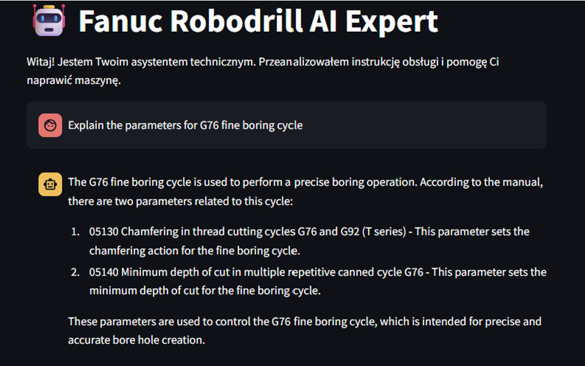
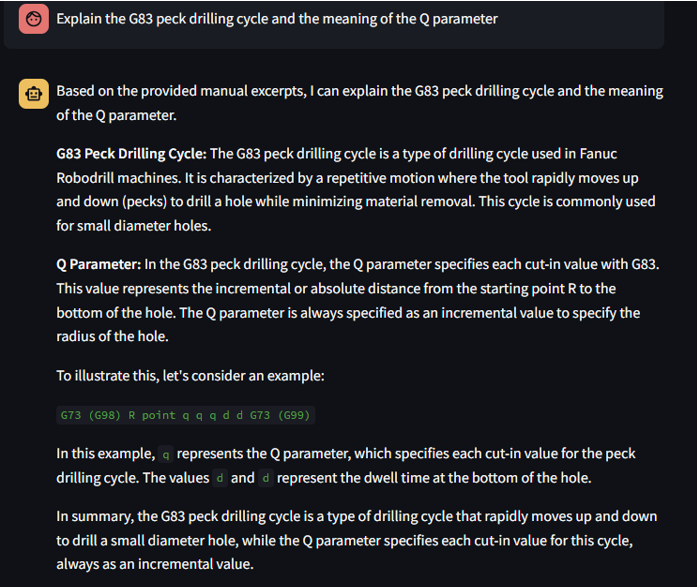

# AI Maintenance Assistant for Fanuc Robodrill  
Offline RAG system for CNC diagnostics and maintenance

---

## Overview

A fully offline Retrieval‑Augmented Generation (RAG) assistant built for Fanuc Robodrill CNC machines.  
The system processes the 988‑page Operation & Maintenance Manual, extracts structured knowledge, builds a local vector database, and integrates with a locally hosted LLM (Ollama + Llama3) to answer technical questions.

All data stays on‑premise — safe for industrial environments with strict confidentiality requirements.

---

## Architecture

PDF Manual (988 pages)
↓
pyMuPDF Extraction
↓
Chapter Reconstruction
↓
Chunking + Embeddings (MiniLM-L6-v2)
↓
ChromaDB (local vector store)
↓
Semantic Retrieval
↓
LLM (Ollama + Llama3)
↓
Final Answer + Sources

---

## Key Features

- Offline LLM execution (Ollama + Llama3)
- Semantic search over the entire manual
- Chapter‑aware chunking with metadata
- Local vector database (ChromaDB)
- RAG pipeline ensuring answers grounded in documentation
- Industrial‑safe (no cloud, no data leakage)

---

## Data Pipeline

### PDF → Clean Text
- Extracted using **pyMuPDF**
- Handles mixed formatting (text + diagrams)
- Cleaned from broken lines and whitespace noise

### Chapter Extraction
- Reads PDF outline
- Reconstructs chapter boundaries
- Produces structured `{title, text}` objects

### Chunking & Embeddings
- `chunk_size = 1500` with overlap
- Embeddings via **all‑MiniLM‑L6‑v2**
- 384‑dim semantic vectors

### Vector Database
- Stored in **ChromaDB**
- Fast similarity search
- Metadata preserved (chapter names)

---

## RAG Workflow

1. User enters a technical question  
2. Query is embedded  
3. Top‑k relevant manual fragments retrieved  
4. Fragments injected into LLM prompt  
5. Llama3 generates a grounded, technical answer  
6. System displays used chapters for transparency  

---

## Example Capabilities

- Daily maintenance steps  
- APC battery alarms and replacement references  
- G76 fine boring cycle parameters  
- Servo diagnostics  
- Alarm list interpretation  
- Parameter explanations  

---

## Notebooks

### `01_data_engineering.ipynb`
- PDF extraction  
- cleaning  
- chapter parsing  
- chunking  
- embedding generation  

### `02_vector_db_and_rag.ipynb`
- ChromaDB creation  
- semantic search  
- RAG pipeline  
- Ollama integration  
- test queries  

---

## Screenshots

### Chatbot answering a maintenance question 1

### Example: Explain the G83

## How to Run

### Requirements
- Python 3.10+
- pyMuPDF
- sentence-transformers
- ChromaDB
- Ollama installed locally
- Llama3 model:
ollama pull llama3

### Steps
1. Run `Robodrill.ipynb`  
2. Run `chatbot.py`  
3. Query the assistant using `ask_the_manual()`  

---

